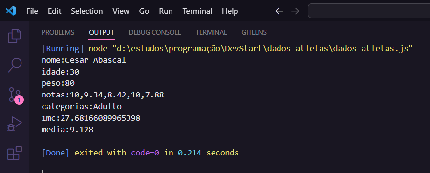

<h1 align = "center">

<p>🤖programming logic🤖</p>
</h1>

## **about📖**

this is the continuation of the challenge **DEVstart** notes athletes.

## **project description🤓**
Create an application capable of receiving information from an athlete, as well as calculating parameters and displaying them to the user.

## **technologies used👾**
- **[JavaScript](https://js.org/)**

## **download the code🤌** 
```bash
# Clone the project
$ git clone https://github.com/kelvin369/dados-atletas.git
```
## **challenge solution image🤯**
<h1></h1>